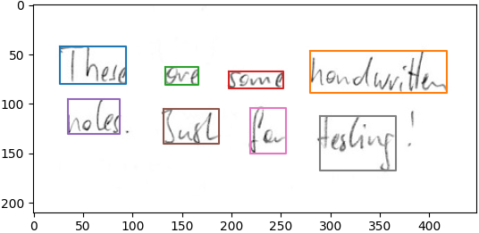

# test_task

## Сервис разпознования рукописных подписей

В качестве детектора рукописного текста 
применен код с репозитория с моделью нейросети - 'https://github.com/githubharald/WordDetectorNN'

Сервис принимает изображение, обрабатывает и возвращает результат с колличеством найденных рукописных подписей.
